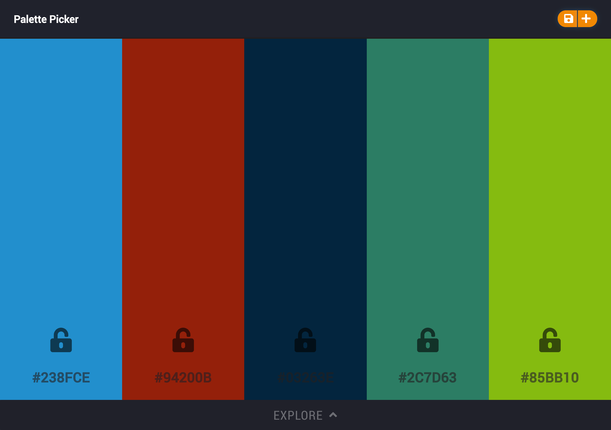
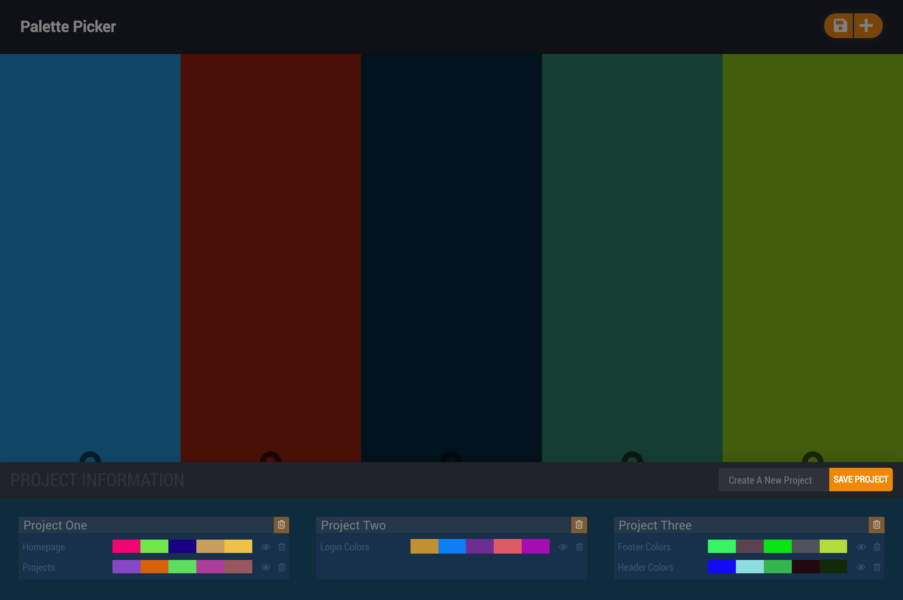
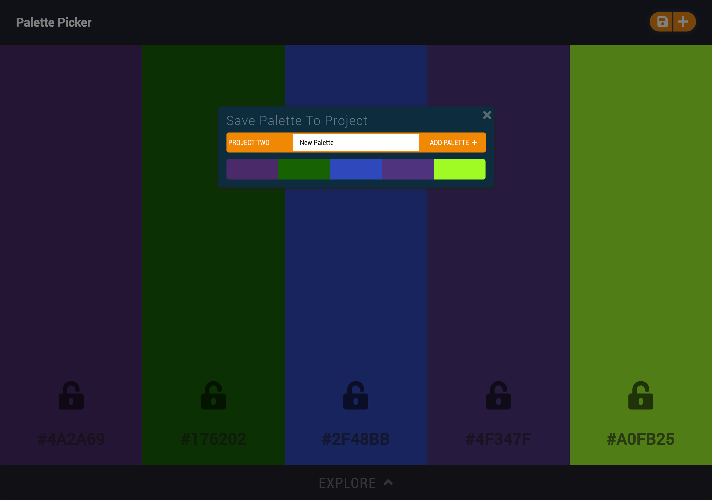

# Palette Picker

## Overview:
Palette Picker is a single page application that gives you the ability to generate color palettes, lock colors, and save palettes to projects. This application utilizes a RESTful API to design patterns associated with building a single app across multiple repositories.

## View Application:
- [View](https://paletteui.herokuapp.com/)

## Preview:


View All Projects          |  Add New Palette
:-------------------------:|:-------------------------:
  |  

## Getting Started:

These instructions will get a copy of the project up and running on your local machine for usage and testing purposes.

### Frontend
clone down the repo: ```$ git clone https://github.com/MRKrog/palette-ui```

cd into directory and run npm install: ```$ npm install```

Start up in your terminal: ```$ npm start ```

### Backend
clone down the repo: ```$ git clone https://github.com/MRKrog/palette-api```

cd into directory and run npm install: ``` $ npm install ```

Start up in your terminal: ``` $ npm start ```


### Technologies Used
Palette Picker was built using:
- [SCSS](https://sass-lang.com/)
- [React.js](https://reactjs.org/)
- [Redux.js](https://redux.js.org/)
- [Node.js](https://nodejs.org/en/)
- [Express.js](https://expressjs.com/)
- [Material-UI](https://material-ui.com/)

And tested using:
- [Enzyme](https://airbnb.io/enzyme/) & [Jest](https://airbnb.io/enzyme/docs/guides/jest.html)


## Contributors
- [Michael Krog](https://github.com/MRKrog)
- [Isaac Sunoo](https://github.com/IsaacSunoo)

---
**[Back to top](https://github.com/MRKrog/palette-ui/blob/master/README.md#palette-ui)**
